# 👋 Hi, I'm Chenyu Wang (王宸禹)

🎓 Graduate Student MCS @ Rice University  
💻 Passionate about Full-Stack Development, AI, and System Design  
📍 Currently based in Houston, TX / Open to global opportunities

---

## 🔧 Tech Stack

### 🖥️ Languages  

### ⚙️ Frameworks & Libraries  

### ☁️ DevOps & Databases  

### 🛠️ Tools  

---

## 🌟 Featured Projects

### 📚 [Local-RAG Document Q&A Assistant](https://github.com/Ireliaww/Local-RAG)
> **[Live Demo on Hugging Face Spaces](https://huggingface.co/spaces/Ireliaaaaaa/rag-document-qa)**
>
> A Knowledge-Enhanced RAG system that lets you chat with your PDF documents. Upload any PDF and ask questions—the assistant uses document knowledge when relevant, and general knowledge when not.

**Tech Stack:** Google Gemini 2.5 Pro | ChromaDB | Gradio | Python

```mermaid
flowchart LR
    A[📄 User Query] --> B[🔍 Retrieve Top-K Docs]
    B --> C{Filter by Threshold}
    C -->|Relevant| D[📝 Answer with Citations]
    C -->|No Match| E[💡 Answer with General Knowledge]
```

---

### 📖 [CET-4 Vocabulary Helper](https://github.com/Ireliaww/CET-4-Vocabulary-Helper)
> A bilingual (Chinese/English) CET-4 vocabulary learning application with modern web app and WeChat Mini Program deployments. Features flip cards, dictation quizzes, AI-powered feedback, and learning statistics.

**Tech Stack:** React 19 | TypeScript | Tailwind CSS | Gemini API | WeChat Mini Program

---

### 🔗 [SnapLink](https://github.com/Ireliaww/Comp_539_Project_Group1)  
> A production-ready URL shortener with full-stack architecture, featuring authentication, link analytics, and CI/CD deployment. Built with Vue 3, Spring Boot, and Google Bigtable.

---

### 📘 [RiceBook](https://github.com/Ireliaww/Ricebook)  
> A full-stack social media application built with the MERN stack. Features user authentication (including Google OAuth), post creation, social interactions, and dark mode support.
>
> **Live Demo:** [Frontend](https://ricebook-frontend.vercel.app) | [Backend API](https://ricebook.onrender.com)

**Tech Stack:** React | Redux Toolkit | Node.js | Express | MongoDB | Firebase

---

### 🖼️ [Multimodal Style Transfer](https://github.com/Ireliaww/COMP646-Project)  
> An AI system combining NLP and computer vision to generate stylized images from text prompts and input photos, powered by CLIP and Fast Style Transfer.

---

## 📊 Most Used Languages

---

## 📫 Contact Me

📮 Email: cw206@rice.edu  
📱 WeChat: NosTalGiaa_y  
🔗 LinkedIn: [linkedin.com/in/rice-eric-wang/](https://www.linkedin.com/in/rice-eric-wang/)

---

_Thanks for visiting my GitHub!_ 😄
